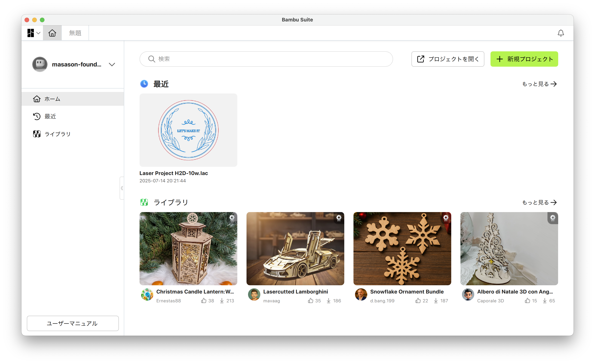
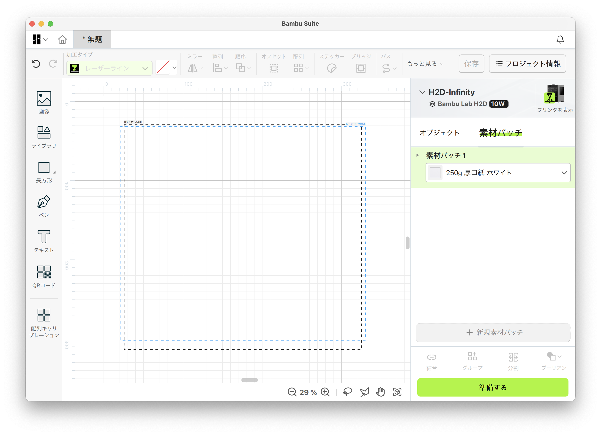
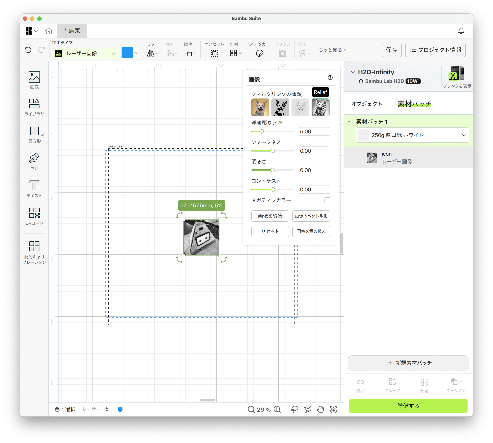
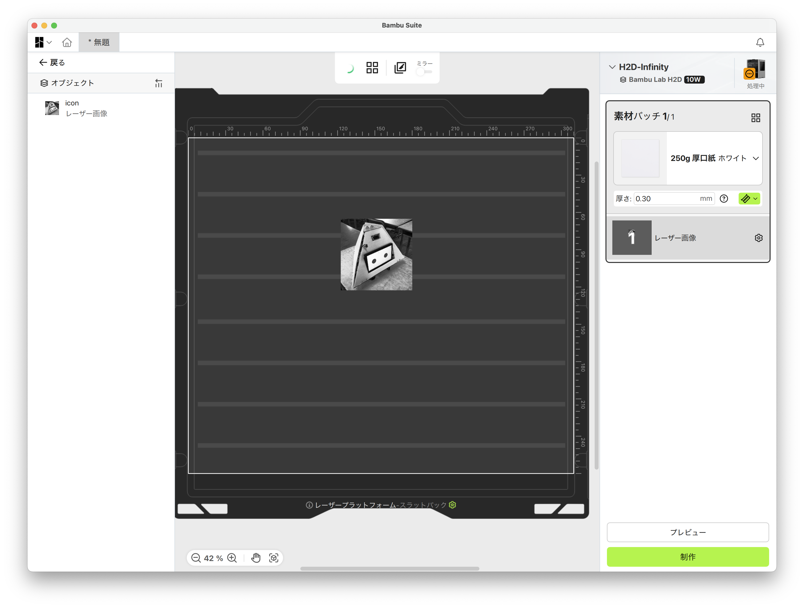
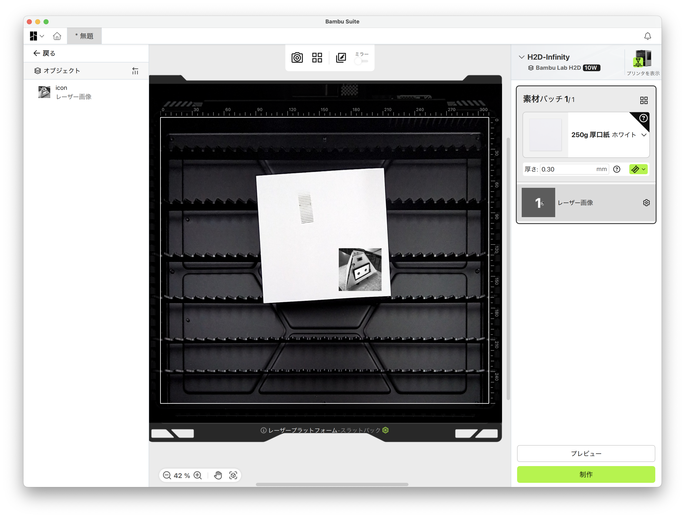
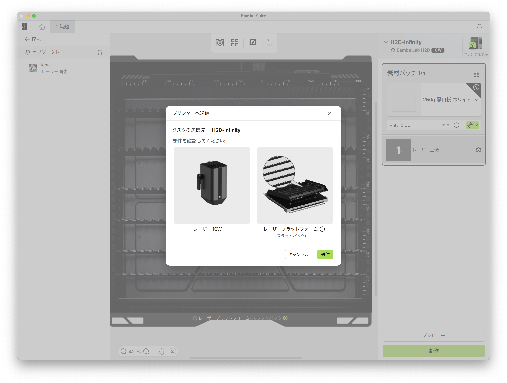
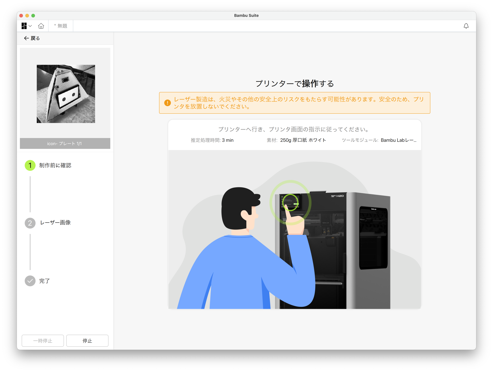

# Bambu Lab H2D Laser Tutorial
このドキュメントでは、Bambu Lab H2Dのレーザーカッター機能の基本的な使い方と設定について説明します。

[全体の概要のページへ戻る](../readme.md)

## ハードウェアセットアップBambu-Lab-H2D-Tutorial
### 1. 準備
画像の3点を準備します。

### 2. レーザーモジュールの取り付け
基本的には、「[Bambu Lab レーザーモジュール 10W クイックスタートガイド](https://csm.bblcdn.com/hub/70839aa962614bcd8780bff4d1e87dc8.pdf)」に従ってください。

**レーザープラットフォームを装着**のページから始めてください。

## ソフトウェアの使い方
### 1. Bambu Suiteのインストール

https://bambulab.com/en/download/suite からBambu Suiteをダウンロードしてインストールします。

masason-foundationアカウントでログインしてください。

### 2. レーザーカットの設定
1. Bambu Studioを起動し、左上の「新しいプロジェクト」をクリックします。
2. 右上の「プリンターの選択」から「Bambu Lab H2D Laser」を選択します。

3. 画面左側の「画像」をクリックし、レーザーカットしたい画像をインポートします。
4. 画像を選択し、フィルタリングを「Relief」にします

5. 「準備する」をクリック
6. 上の「カメラアイコン」をクリックして、レーザーカットのプレビューを確認します。

