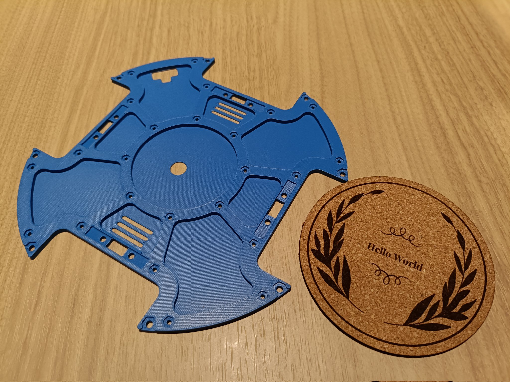
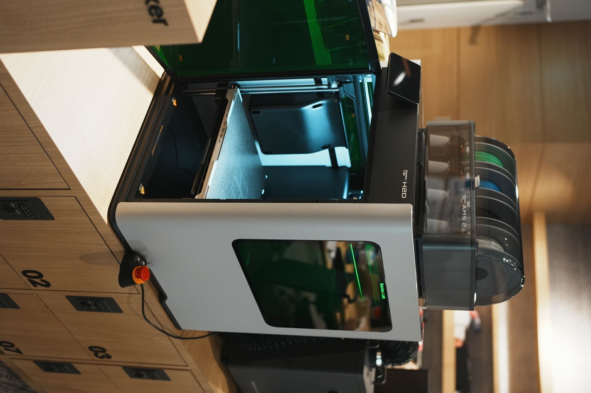

# Bambu Lab H2D Tutorial (非公式)
このドキュメントでは、Bambu Lab H2Dの基本的な使い方と機能について説明します。

孫正義育英財団 渋谷Infinityに設置されているBambu Lab H2Dを対象としています。

ソースは[GitHubリポジトリ](https://github.com/Jun-robot/Bambu-Lab-H2D-Tutorial)で公開しています。プルリク大歓迎です。

作成者: [Jumpei Saito](https://jun-robot.github.io/about/)

## 1. できること
### 3Dプリント

### レーザーカット [使用方法](laser/laser.md)

### カッター

### ペンプロッタ

## 2. お願い
使用後は以下の状態に戻っていることを確認してください。

### 全体
<!--  -->

### ツールヘッドを3Dプリントヘッドに戻す

### プラットフォームを元に戻す
