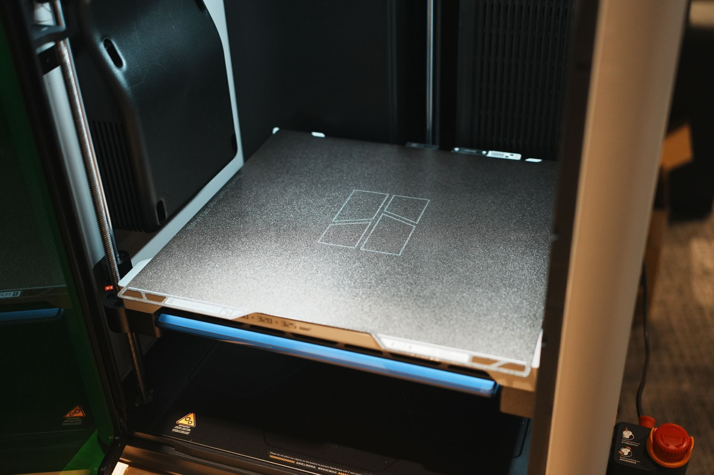

# Bambu Lab H2D Tutorial (非公式)
このドキュメントでは、Bambu Lab H2Dの基本的な使い方と機能について説明します。

孫正義育英財団 渋谷Infinityに設置されているBambu Lab H2Dを対象としています。

ソースは[GitHubリポジトリ](https://github.com/Jun-robot/Bambu-Lab-H2D-Tutorial)で公開しています。プルリク大歓迎です。

## 1. できること
- 3Dプリント
- レーザーカット
- カッター
- ペンプロッタ

## 2. 注意事項
使用後は以下の状態に戻っていることを確認してください。

- 全体

- ツールヘッドを3Dプリントヘッドに戻す

- プラットフォームを元に戻す

